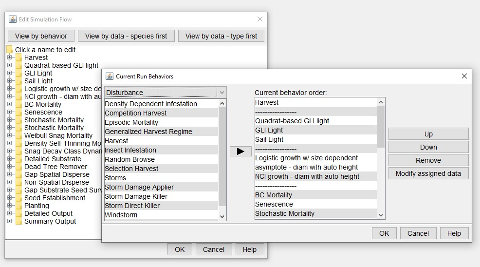

```{r, include = FALSE}
knitr::opts_chunk$set(
  collapse = TRUE,
  comment = "#>"
)
```

```{r setup}
library(rsortie)
```

This vignette describes the files required to run `rsortie` for editing a harvest or planting, but can apply to substituting other behaviours as a chunk of xml code as well. `makeFiles()` can search through xml files identified in the list of files (new values files), and if it encounters xml code chunks, it will replace one section at a time, in order. Any number of xml sections can be present in a new values file, and the file can include both sections to delete or sections to replace.

**if you include an xml section substitution in a slot before values substitution in the list of files passed to `makeFiles()`, the new values will be substituted in the new xml section.**


# Base SORTIE parameter file
To modify, replace or delete a harvest (plant, or other behaviour), the base SORTIE parameter file must contain the behaviour. It will be assigned a behaviour list position. To add a new behaviour to a SORTIE parameter file, use Edit > Model Flow > View by behaviour and click any of the folders. 




# creating an xml code chunk
There are different ways of producing an xml file that contains a chunk of code to substitute for that in the Base SORTIE parameter file. One way would be to copy the harvest chunk out from first tag to the last tag into a new text file and save as an xml. That code can be replicated and changed in R or elsewhere, and once saved, can be called in the list of files for a `makeFiles()` new parameter file creation in the list of files (see <https://aclason.github.io/rsortie/articles/prepare_inputs.html> and <https://aclason.github.io/rsortie/articles/using_makeFiles.html>)

**The file must contain complete xml format code**

# Substitute a chunk of xml code 

The new values file can contain a completely new set of behaviours or parameters, such as allometry or GapDispersal21. The tool will look at the first line of the file, determine what to look for, and replace all the lines between the beginning and end of the section with the
new code. For example, you could use this to completely replace the allometry section of
the input file.

# Delete an xml section

Put the name of the section that you wish to delete in the first line of the xml file (e.g. StochasticMortality9). The second line of the file must contain -999. The `makeFiles()` function will then find the section that corresponds to what is in the first line of the file, and then
remove it entirely from the final xml file. For example:
<br>
<span style="color: purple;">StochasticMortality9</span>  
<span style="color: purple;">-999</span>  
<span style="color: purple;">StochasticMortality9</span>  


