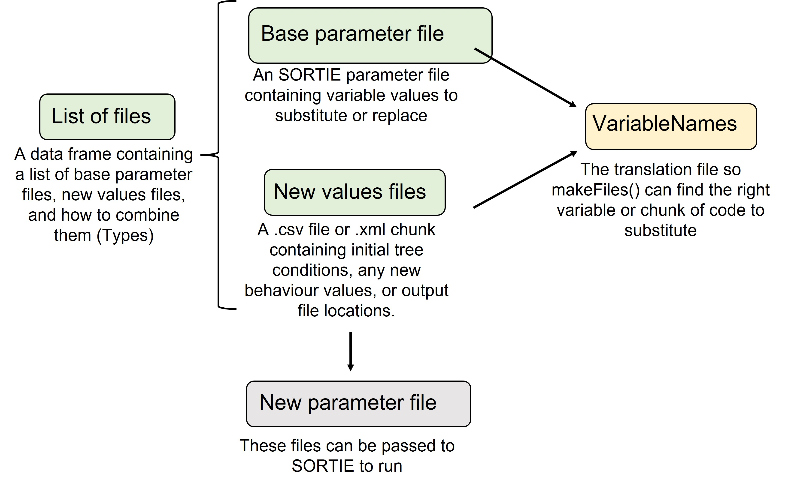
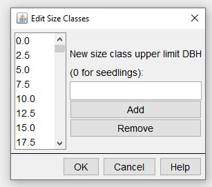
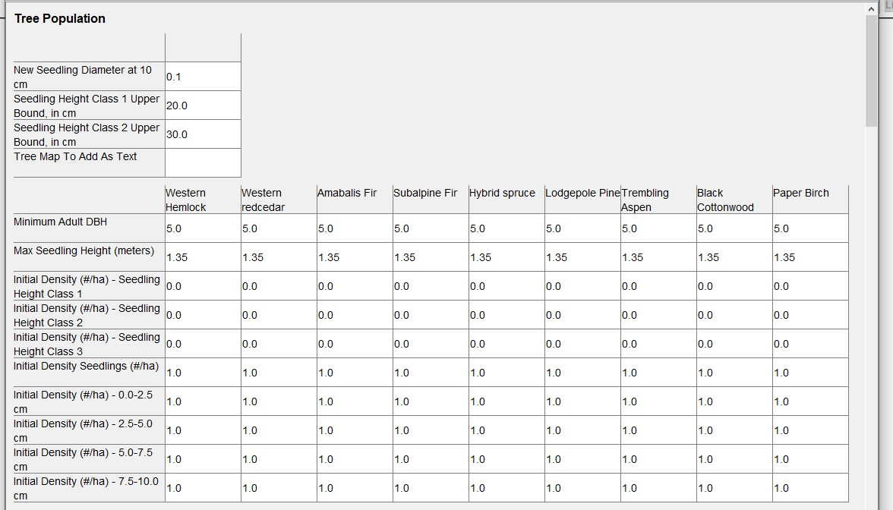
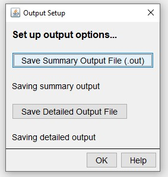
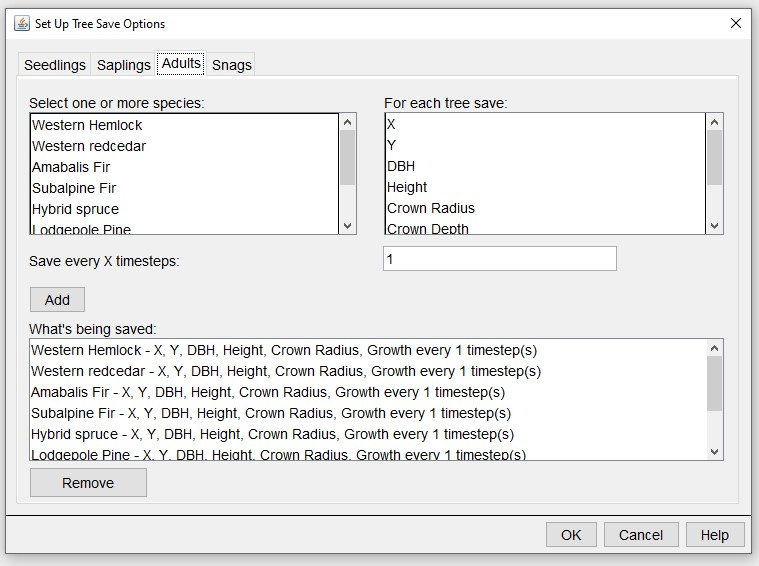
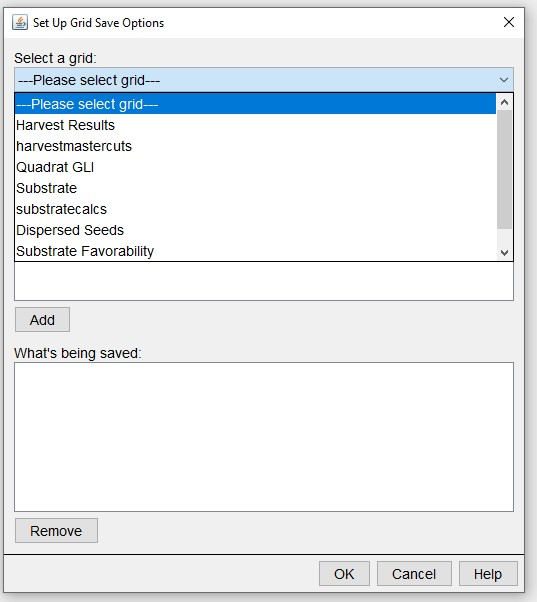
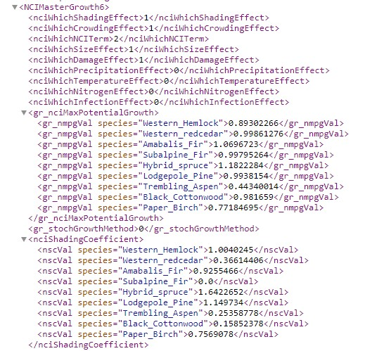

```{r, include = FALSE}
knitr::opts_chunk$set(
  collapse = TRUE,
  comment = "#>"
)
```

This vignette describes the files required to run `rsortie` for editing and creating new SORTIE parameter files.

# **Inputs**



There are files that users must prepare (green), a default file (yellow) and the resulting file(s) (grey) that we will describe in detail here to support creating new SORTIE parameter files using rsortie

*Required for users to prepare:*

* Base SORTIE parameter file
* A list of the files to be used
* New values to substitute those in the base parameter file and/or
* .xml chunks to substitute with those in the base parameter file.

*Default available:*

* VariableNames - to translate R objects to SORTIE base parameter files

## **Base SORTIE parameter file (xml)**
To set up a base parameter file and run SORTIE, you must already have access to a parameter file. SORTIE comes with an example parameter file called GMF.xml for practice and learning.

### Behaviours

`rsortie` interacts with SORTIE parameter files. These files are .xmls that contain the list of variables within the behaviours that are user defined in the SORTIE GUI. `rsortie` cannot interact with or change elements that do not already exist in the base .xml file, so it is crucial to also understand the GUI in order to add or remove behaviours for an `rsortie` simulation.  
Importantly, if you intend to assign values to variables, within the selected behaviours, primarily in `rsortie`, you must assign a non-zero value to those variables, or those lines do not get printed to the base .xml file.

**All the behaviours, including harvests or plantings, that you want to interact with in rsortie must be contained within the base file.**

When the .xml is saved from SORTIE, only the selected behaviours are included in the .xml and each behaviour is assigned a list position. If you add or remove a behaviour in the SORTIE GUI, these list positions will be automatically updated in the resulting .xml. However, we don't yet have this capability of adjusting behaviour list positions in `rsortie`, and it may not be possible.  

Any of the behaviours can be populated with dummy variables (1s) and harvest or planting areas (just select some cells in the harvest and planting interfaces), as these can all be substituted using `rsortie`. As long as they exist in the base .xml file, often with a non-zero value required, all variables within behaviours can be changed in `rsortie`.

#### Tree population

The base SORTIE parameter file must contain the species and diameter size classes required to set up an initial tree population. These changes must be done in the SORTIE GUI.  
Edit > Tree Population > Edit species list/ Edit initial density size classes:  

  
<br>
You can use `rsortie` to remove an entire species from a base SORTIE parameter file, but you cannot add a species in `rsortie`. So again, set up the base file in the GUI to contain all the species that might be used in a run.

A common mistake is to leave 0s in all the tree species-diameter size classes for the initial stand conditions, but 0s will result in that species-diameter class not being available in the actual saved base .xml parameter file. Populate each of these with a 1 in the base parameter file in the GUI, and then they will be available for substitution by zeros or non-zeros using `makeFiles()` in `rsortie`.

  
<br>
We typically also set the output options for the base parameter file in the SORTIE GUI.  
Edit > Output Options:  
  
  
<br>
Select the information that will be added as columns from each tree.  
Save Detailed Output File > Advanced Options > Live Trees:  

  
<br>  
And which grids to track.  
Save Detailed Output File > Advanced Options > Grid Data Layers:  
  
  
<br>  
For more information on these output options and the behaviours that create them, please visit <http://sortie-nd.org/help/manuals/index.html>.
<br>

### **A List of files** 

To substitute variable values or chunks of .xml in a base SORTIE parameter file, `rsortie` requires a list of files passed to the `makeFiles()` function. This list of files can be stored as a .csv in a folder outside of R, or it can be created in R and passed as an object to the `makeFiles()` function.  

There are six different file types allowed in this table of files, with a minimum of two types required (0 and 1).  

| Type |  Description         | Required |
|:----:|:---------------------|:--------:|
| 0    | Base parameter file  | Yes      |
| 1    | New values file      | Yes      |
| 2-5  | New values file      | No       |

There can be more than one of any of the file types. The code will loop through all combinations of the files. The resulting .xml files will be named with a combination of each of the names present: type0-type1-type2.xml.  
The column names must be: type and name.  
  
Example:  

type, name  
0, Test.xml  
1, t1.csv  
2, f2.xml  
2, g2.csv  
3, p3.csv  
3, r3.csv  

The resulting output files will be named: test-t1-f2-p3.xml, test-t1-f2-r3.xml, test-t1-g2-p3.xml,
test-t1-g2-r3.xml.  
  
  
### **VariableNames** 

This a translation file that matches the parameter names in the new values input file with those in the base parameter file. It also includes the variable 'type' value that is critical for successful substitution of variable values.  

`rsortie` comes with a default VariableNames data.frame. However, if the user has a different variable naming convention than the default, VariableNames can be updated in R with new rows (using `treelistDfn()`), or a user can pass their own VariableNames data.frame and override the default in the `makeFiles()` function. 

```{r echo= TRUE, eval=TRUE}
library(rsortie)
?makeFiles
head(VariableNames)
```

#### Editing VariableNames

The VariableNames file contains two important pieces of information: (1) mapping the variable name in the input new values file(s) to the corresponding base parameter file variable name, and (2) the type of the variable in the .xml file. **You must be familiar with the SORTIE base parameter file** because this file contains the names that `rsortie` will use to identify what to change.  

If making your own VariableNames data.frame, column headings must be:

     *col 1: InputFileParameterName
     *col 2: Type
     *col 3: code.name
     *col 4: group.name

##### *VariableNames: Input file Parameter Name*
The input file parameter names specify the names of the variables as contained in the "new values file(s)". In other words, these are the names assigned by users to whichever variables are intended for substitution. These can be the unique names assigned to tree size classes (e.g., Initial_Density_4cm) or the names of a variable within a behaviour (e.g., Max_Growth_NCI). 

**The naming convention in the new values files can be anything you want, but they must match *exactly* with the names in the first column of the VariableNames data.frame**

##### *VariableNames: Type*
The base parameter file contains many different formats for its behaviours and variables. Some behaviours are simple with the variable name and its value on the same line. Some include species, and some are grouped in a more complex .xml hierarchy structure. Some are completely uniquely named, but many require first identifying the location of the correct behaviour and then finding the appropriate variable name within that behaviour. The Type column in the VariableNames data.frame is critical to identify the format of the variable and thus the rules in the code for finding and replacing the right variable. So far, eight different formats have been identified and coded:

1 = basic case: variable parameter is directly after the name
2 = basic case with species: same, but with a species name after it
3 = behaviorlist type: but basic parameter - similar to 1
4 = behaviorlist type: but with species - similar to 2
5 = output files: so parameter file will have a directory name
6 = groups with species on the previous line, e.g. for initial density
7 = disturbance types
8 = behaviourlist type: similar to 4, but no subgroup, because of unique tag

_Variable Types: <span style="color: blue;">Blue text</span> is an example from the base parameter file (the SORTIE-generated file). <span style="color: green;">Green text</span> is an example from the VariableNames file and <span style="color: purple;">purple text</span> is the example from the parameter value file (the csv file)._  
<br>

**Type 1:** the value is on the same line and directly after the variable name: 

<span style="color: blue;">\<timesteps\>20\</timesteps\></span>   
<span style="color: green;">Timesteps,1,timesteps,</span>  
<span style="color: purple;">Timesteps,66,66,66,66</span>  
<br>  
  
**Type 2:** the parameter includes a species name, but the value is still on the same line:

<span style="color: blue;">\<tr_mshVal species="Interior_Spruce"\>1.35\</tr_mshVal\></span>  
<span style="color: green;">Max.Seedling.Hgt.m, 2, tr_mshVal species,</span>  
<span style="color: purple;">Max.Seedling.Hgt.m,1.35,1.35,1.35,1.35</span>  
<br>

**Type 3:** the parameter is like a type 1, but is inside a BehaviourList. The BehaviourList becomes part of the input parameter file, since it is specific to the .xml file that is being used.  

<style>
.nobullet li {
  list-style-type: none;
}
 div{
       display: inline-block;  
    }
</style>

<span style="color: blue;">\<NCIMasterGrowth5\></span>  
<div class="nobullet">
* <span style="color: blue;">\<nciDbhDivisor\>100.0\</nciDbhDivisor\></span>
</div>  

<span style="color: green;">NCI.DBH.div,3,nciDbhDivisor,</span>  
<br> 

<span style="color: purple;">NCIMasterGrowth5,</span>  
<span style="color: purple;">NCI.DBH.div,100,100,100,100</span>  
<br> 

This type could also be inside a grid:
  
<span style="color: blue;">\<grid gridName="harvestmastercuts"\></span>  
<div class="nobullet">
* <span style="color: blue;">\<ma_plotLenX\>100\</ma_plotLenX\></span>  
* <span style="color: blue;">\<ma_plotLenY\>200\</ma_plotLenY\></span>  
</div>  
<span style="color: blue;">\</grid\></span>  
<br>

<span style="color: green;">plotLenX,3,ma_plotLenX,</span>  
<span style="color: green;">plotLenY,3,ma_plotLenY,</span>  
<br> 

<span style="color: purple;">harvestmastercuts</span>  
<span style="color: purple;">plotLenX,100,100,100,100</span>  
<span style="color: purple;">plotLenY,200,200,200,200</span>  
<br>

**Type 4:** the parameter is like a type 2, but is inside a BehaviourList. The BehaviourList becomes part of the input parameter value file, since it is specific to the .xml file that is being used. Note that type 4 must also contain a group name in the VariableName file. (This is because in a very few cases, the same variable is use multiple times in the .xml file and we need the group name to figure out which case it is.)

<span style="color: blue;">\<NCIMasterGrowth5\></span>  
<div class="nobullet">  
* <span style="color: blue;">\<gr_nciMaxPotentialGrowth\></span>  
    * <span style="color: blue;">\<gr_nmpgVal species="Interior_Spruce"\>4.0152016\</gr_nmpgVal\></span>
</div>  

<span style="color: green;">NCI.MaxGrowth,4,gr_nmpgVal species, gr_nciMaxPotentialGrowth</span>  
<br> 

<span style="color: purple;">NCIMasterGrowth5,</span>  
<span style="color: purple;">NCI.MaxGrowth,1.65655768851703,2.22957895018928,1.75110747720752,2.37639294490124</span>  
<br>

**Type 5:** Output files. The code assumes that the parameter value file contains a directory. When the code writes this information to the xml file, it writes the directory specified in the parameter value file and then a unique file name. Currently the code is set-up to do Output and ShortOutput with specific file extensions. In this version of the code, other file types may not work, even if added to the VariablesName file.

<span style="color: green;">ShortOutput,5,so_filename,</span>  

<span style="color: purple;">ShortOutput,C:\\Projects\\SORTIE\\test\\</span>  
<br>

**Type 6:** groups with species on the previous line.

<span style="color: blue;">\<tr_idVals whatSpecies="Lodgepole_Pine"\></span>  
<div class="nobullet"> 
* <span style="color: blue;">\<tr_initialDensity sizeClass="s4.0"\>25.0\</tr_initialDensity\></span>  
</div>  

<span style="color: green;">Init.Dens.4,6,tr_initialDensity sizeClass="s4.0",tr_idVals</span>  
<br> 

<span style="color: purple;">Init.Dens.4,0,0,75,0</span>  
<br>  
  
**Type 7:** Disturbance types (e.g. Episodic Mortality). This is like the Behaviour types. In the new values file, the disturbance type goes on one line and then the variable name and values for each species on the following line. The VariableNames file just requires the names and type. You would use this type to update species-specific parameter values (i.e. amount of lodgepole pine to harvest), as opposed to replacing the harvest layout with an .xml chunk.

<span style="color: green;">amountToCut,7,ds_amountToCut,</span>  
<br> 

<span style="color: purple;">EpisodicMortality1</span>  
<span style="color: purple;">amountToCut,55,56,57,58</span>  
<br>  
  
**Type 8:** the value is within a behaviour list (similar to 4), but no subgroup  
  
<span style="color: blue;">\<Plant12\></span>  
<div class="nobullet"> 
* <span style="color: blue;">\<gr_nmpgVal species="Interior_Spruce"\>4.0152016\</gr_nmpgVal\></span>  
</div>
  
The current version of the VariableNames file is not exhaustive. It only contains those variables that were being used in the testing files. However, new variables that fit one of the eight currently defined types should be able to be added and the code should run.

##### *VariableNames: code.name and group.name*
To find variable names in the base parameter file associated with a behaviour, open the base parameter file and locate the behaviour of interest. Depending on the behaviour, there will be at least one but sometimes two names required to include in the VariableNames file: code.name is always required, and group.name sometimes.

First look at the base parameter file in an .xml viewer, such as internet explorer:

  
<br>
Compare this structure to that found in the VariableNames file:

```{r echo=TRUE, eval=TRUE}
VariableNames[20:40,]
```

This example illustrates that the variable code.name is always adjacent to the value that is going to be updated, while the variable group.name is only required when there's a grouping variable name.

In summary, to add a new variable to the VariableNames file:

1. Find the line in the base parameter file that contains the right information.
2. See which of the current eight types fit.
3. Make a note of the relevant variable name(s) as written in the base parameter file. The species name is not important, but the Behaviour List name or the group name may be important.
4. Look at the new values file and determine or assign the corresponding *input file variable name*.
5. Edit the VariableNames file to add the variable name (step 4), type (step 2), base parameter file variable name(s) (step 3). Note that the order of the lines in the VariableNames file does not matter, so this new line may be added at any point in the file.
6. Comments may be added to the VariableNames file by prefacing the line with “!”.
  
**All strings in VariableNames are completely case and space sensitive; the code is looking for exact matches. For example, use Timesteps not TimeSteps or timesteps or Time steps.**  

 
### **New values files** 

There are two types of new values files: .csv and .xml  

In all cases, variables are updated in the base parameter file in the order that they are in the new values file, and in the order of the slot of list of files passed to `makeFiles()`. New value files are read from top to bottom, and file slots from the list of files are addressed from 1 to 3. So, a variable that is in slot 3 will supersede one that is in a slot 1 file. This could be useful, for example, if you wish to replace an .xml section (e.g., as a slot 2 file), but then change one of its parameters (e.g., in a slot 3 file).  

#### **CSV files**
These files contain a set of new values for different variables.  

  + The first row must be a blank column and then the species names as in the .xml file. As with variable names it is critical that the species names are exactly the same as they are in the .xml file and the code searches for an exact match.  
  + The second line must be “na” if the values proceeding are Types 1 or 2 (no associated behaviour), or the name of Behaviour to which the variables following it apply. The Behavoiur name comes from the base parameter file, so requires knowledge of the .xml file and its naming. It is also necessary to give the list name because there could be multiple behavior lists with the same set of variable names. The behaviour name must also have the behaviour list position number attached to it (e.g. logisticgrowth7, competitivemortality9) - again, this will be found in the base parameter file
  
**Adding or remove a behaviour during the development of the base parameter file, be sure to track the behaviour list position of any variables that might be substituted using `rsortie`**
  
  + When the variables for the behavior are finished, if there are variables from different behaviours, or switching to variables without behaviours (e.g. timesteps or output directory), you need to mark the start of the new section with either the next Behaviour name (with list position number) or “na” if no behaviour. 
  + If the variable has values for each species, the code looks for a variable in the corresponding column. If the variable is not species specific (e.g. timestep), then only the first column is used. *Values can be in the other columns, they will just be ignored.* 
  + The code will create output file names for each new parameter .xml file and append this output parameter file name to the given output directory. 
  
  **The new values file should always include the directory into which the output should be placed.** 
  
  + The format of the output directory pathway must include a final “\” and will look something like: "Output,C:\\Projects\\SORTIE\\test\\" for the detailed output, and "ShortOutput,C:\\Projects\\SORTIE\\test\\" for the summary output.
  + The output file name will be a combination of the base parameter file name and the new values file name, which is also the file name used for the new parameter file. Note that the file extension on the Output file will be _det.gz.tar and on the ShortOutput fill be .out. For example, a new parameter file: base-123.xml, detailed output file: base-123_det.gz.tar, and summary output file: base-123.out.
  
**If output file directory paths are not provided in the new values file, SORTIE may fail to run as the output directory in the base parameter file may not exist on the local computer**  

#### **XML files**
The second type of new values file enables the replacement or deletion of .xml code. The tool replaces the existing lines of text with the new lines of text from the file or delete a section of code. The file must contain complete .xml format code.  

  + **Substitute all variables from a behavior:** The file can contain a completely new set of variables contained within a behaviour, such as allometry or GapDispersal21. The tool will look at the first line of the new values file, determine what to look for, and replace all the lines between the beginning and end of the section with the new code. For example, you could use this to completely replace the allometry section of the input file. This is frequently used in replacing a harvest placeholder in the base parameter file with the entended harvest design  
  + **Delete an xml section:** Put the name of the section that you wish to delete in the first line of the .xml file (e.g. StochasticMortality9). The second line of the file must contain -999. The tool will then find the section that corresponds to what is in the first line of the file, and then remove it entirely from the final .xml file. For example:  
\<StochasticMortality9\>  
\<delete\>-999\</delete\>  
\</StochasticMortality9\>

The `makeFiles()` function in `rsortie` will search through the new values .xml file, replacing one section at a time, in order. Any number of .xml sections can be present in this file, and the file can include both sections to delete or sections to replace.

*Deleting behaviours through a new values .xml file as part of the makeFiles function requires further testing*
