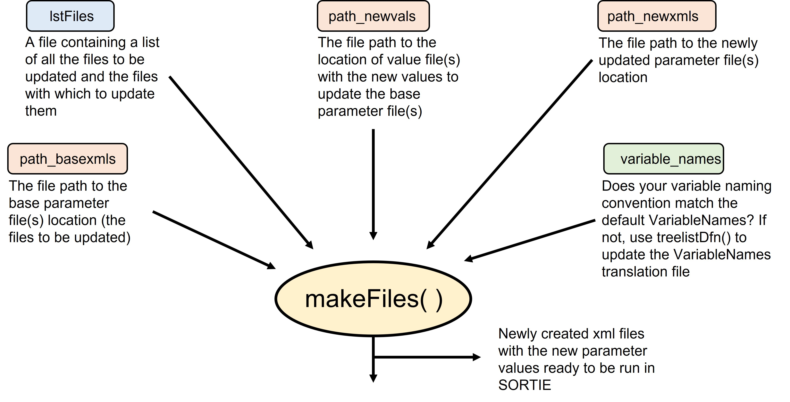

```{r setup, include = FALSE}
knitr::opts_chunk$set(
  collapse = TRUE,
  comment = "#>",
  tidy.opts = list(width.cutoff = 60), 
  tidy = TRUE
)
```

This vignette describes how to create one or more new SORTIE parameter files that will substitute new values or chunks of .xml code from the base SORTIE parameter file.  
<br>  

These are the components that `makeFiles()` needs to run:


<br>  
  
In this vignette, we assume the user has read and understood the *rsortie Basics* and *Preparing inputs of rsortie* vignettes and their files are ready to run.

### 1. Load the `rsortie` library

```{r echo=TRUE, eval=FALSE}
library(rsortie)
?makeFiles
```


### 2. Optional: Set your pathways

While creating a folder structure is entirely up to the user, we typically default to a system that helps us keep track of the various files required to create and store SORTIE parameter files.  
<br>  

*For example*:

Inputs  
  
* FileLists  
* ParameterFiles  
    * BaseFiles  
* ParameterValues  
<br>  

`rsortie` allows pathway arguments to be passed to the `makeFiles()` function in order to accommodate the folder structure outlined above, or any user-defined pathways. If you are using a Rstudio project, you can use relative pathways, which helps make code more reproducible on other computers.

```{r echo=TRUE, eval=FALSE}
# Change the loc_path to your working directory
loc_path <- "ExampleDirectory/ProjectName/Inputs/" 

# Pathway to base .xml file(s)
My_basePath <- paste0(loc_path,"ParameterFiles/BaseFiles/")

# Pathway to file(s) containing the new values with which to update the base 
# parameter file
My_newvalsPath <- paste0(loc_path,"ParameterValues/")

# Pathway to location of newly created/ updated parameter files
My_newxmlPath <- paste0(loc_path,"ParameterFiles/")
```

Alternatively, all files can be stored and written to the working directory, and in that case, no pathways would be passed to  `makeFiles()`.

### 3. Optional: Update VariableNames

Any new variables and behaviours can be appended to the default VariableNames object, or a user-defined VariableNames table can be passed to `makeFiles()`. See the *Preparing inputs of rsortie* vignette for a  detailed description of the requirements for building a VariableNames table.

Within `rsortie`, we currently support adding the user's initial tree density size naming convention and size classes to the default VariableNames object.

```{r echo=TRUE, eval=FALSE}
?treelistDfn

tail(VariableNames)
# for example
My_Names <- treelistDfn(initname = "InitialStems", numDigits = 1, diamMin = 1.5, diamMax = 100, diamInc = 1.5)

tail(My_Names)
```

### 4. Run `makeFiles()`

```{r echo=TRUE, eval=FALSE}
#example with pathways:
makeFiles(lstFiles = My_Files, path_basexmls = My_basePath, path_newvals = My_newvalsPath, 
          path_newxmls = My_newxmlPath, variable_names = My_Names)

#example without pathways (all files in working directory)
makeFiles(lstFiles = My_Files, variable_names = My_Names)

```


